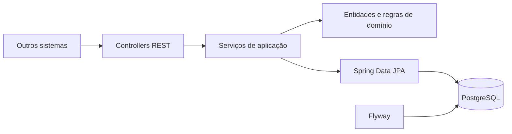

# Arquitetura

## Visão geral

A aplicação é um monólito modular. Para a primeira versão, essa abordagem reduz complexidade operacional sem impedir evolução futura para serviços independentes.

## Módulos

- `customer`: cadastro, consulta, validação de CPF e remoção lógica.
- `account`: conta, saldo, bloqueio, saque, depósito e extrato.
- `common`: erros e tratamento HTTP compartilhado.
- `config`: propriedades, relógio de negócio e OpenAPI.

## Consistência financeira

Depósito e saque executam dentro de uma transação de banco e recuperam a conta com `PESSIMISTIC_WRITE`. Assim, duas requisições concorrentes para a mesma conta não calculam o novo saldo a partir do mesmo valor antigo.

Além da regra Java, a tabela `accounts` possui `CHECK (balance >= 0)`. A proteção existe no domínio e no último nível de persistência.

## Limite diário

O acumulado de saques é consultado entre o início do dia e o início do dia seguinte no fuso definido por `BUSINESS_TIMEZONE`. O valor é configurável por `DAILY_WITHDRAWAL_LIMIT`.

## Remoção de cliente

A remoção é lógica para não apagar histórico financeiro. Se a conta tiver saldo positivo, a operação é rejeitada. Com saldo zero, a conta é encerrada e o cliente é marcado como inativo.

## Evolução para microsserviços

A separação natural seria:

1. `customer-service` como proprietário do cadastro e CPF.
2. `account-service` como proprietário de conta e saldo.
3. `transaction-service`/ledger append-only para alto volume e auditoria.
4. Eventos de domínio via broker e padrão Outbox para integração confiável.

Essa divisão só deve ocorrer quando escala, autonomia de equipes ou requisitos de disponibilidade justificarem o custo distribuído.
