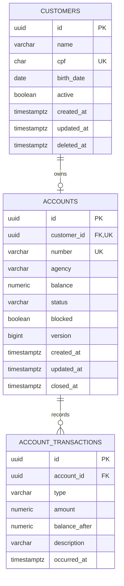

# Modelo de dados

## Restrições relevantes

- CPF único e armazenado sem pontuação.
- Uma conta por cliente (`UNIQUE customer_id`).
- Número da conta único.
- Saldo e saldo resultante nunca negativos.
- Valor da transação estritamente positivo.
- Transações não são apagadas em cascata.
